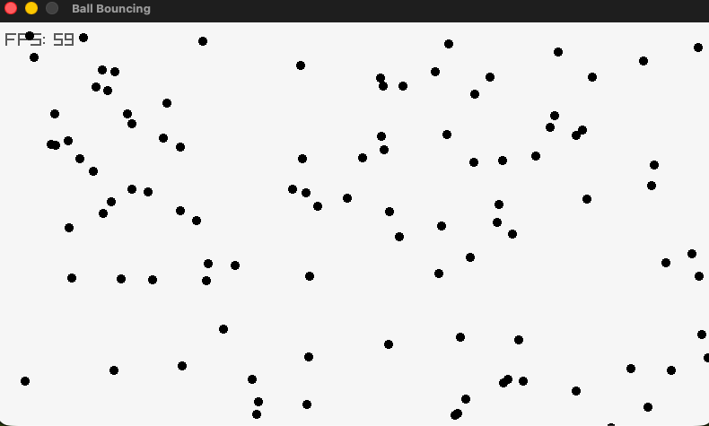

Bouncing balls with raylib



### Dependencies

Make sure you have [raylib](https://www.raylib.com/) installed.

#### macOS (using Homebrew)
```sh
brew install raylib
```

# Run
```sh
make run
```

